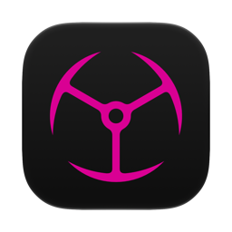

<p align="center"></p>

# Imperator EQ

A system-wide 10-band parametric equaliser for macOS, living in the menu bar.

macOS has no built-in EQ for system output. Imperator EQ adds one: it captures everything the
Mac plays, runs it through an equaliser, and sends the result to your speakers or headphones.
No per-app setup, and nothing else on the system has to be configured.

Requires macOS 13 or later, Apple silicon or Intel. Built and tested on macOS 27 only; older
versions are expected to work but have not been verified.

Install at your own risk. The app is not notarized and carries no Apple Developer signature,
so macOS cannot vouch for it. It is provided as is, with no warranty, under the MIT license.

## What it does

- 10 EQ bands from 32 Hz to 16 kHz, plus or minus 12 dB each
- Volume boost up to 200% and left/right balance
- Named presets you can save, rename, reorder and delete
- Output device switching from the panel
- Runs in the menu bar with no Dock icon, and can open at login

## Install

Download the zip from the [releases page](https://github.com/goranimperator/imperator-eq/releases),
unzip it, and drag `Imperator EQ.app` into `/Applications`. The app is signed with a
self-signed certificate rather than notarized, so the first launch needs a right-click and
**Open** to get past Gatekeeper.

On first run the app installs the BlackHole 2ch audio driver it bundles, which needs an
administrator password once.

## Permissions

**Microphone.** macOS treats the loopback device as an audio input, so the system asks for
microphone access the first time the equaliser starts. The app records nothing and never
touches the built-in microphone; the permission covers the loopback capture of your own
system audio. Without it macOS refuses to open the audio stream and the EQ stays inactive,
though the menu bar icon and the panel still work. If you dismissed the prompt, grant it
under **System Settings > Privacy & Security > Microphone**.

While the EQ is running, macOS shows the orange microphone indicator in the menu bar. That is
the loopback capture, not the built-in microphone.

**Administrator password, once.** Installing the bundled BlackHole driver writes to
`/Library/Audio/Plug-Ins/HAL`, which needs authorisation. Nothing after that does.

## Use

Click the waveform icon in the menu bar to open the panel. The switch in the header turns processing on and
off. Drag the band sliders to shape the sound, or pick a preset. **Reset** returns every band
to flat. The output device list picks where the processed audio goes, and **Open at Login**
starts the app with the Mac.

## The menu bar panel

The panel is drawn by the app, not by `NSPopover`. macOS 27 draws its own menu bar panels as
plain rounded rectangles with no arrow and no open or close animation, and `NSPopover` draws
neither that shape nor that corner and offers no way to set one. The measurements behind the
corner radius, and the reason the constant is not the number it draws, are written down in
`Sources/ImperatorEQ/MenuBarPanel.swift`.

## How it works

System audio is routed into BlackHole 2ch, a virtual output device. The app builds an
aggregate device combining BlackHole's input with your real output, pulls audio through an
`AUNBandEQ` Audio Unit, and writes the processed result back to the real device.

```
System audio -> BlackHole 2ch (default output)
             -> Aggregate device (BlackHole in + real out)
             -> AUHAL -> AUNBandEQ (10 bands) -> volume and balance
             -> Speakers or headphones
```

Selecting a different output device rebuilds the aggregate around it. If the app is killed
without shutting down cleanly, the next launch restores whatever output device was default
beforehand, so the Mac is never left playing into a virtual device with no speakers attached.

## Build

```bash
bash build.sh
```

That runs a universal release build, assembles `Imperator EQ.app`, signs it, and copies it to
`/Applications`. Signing is not optional: Gatekeeper blocks an unsigned bundle.

`swift build` on its own produces the binary without the app bundle, which is enough for
checking that the code compiles but not for running the app.

Two things the build does that are easy to miss:

- It stamps the binary with the current SDK through `-Xlinker -platform_version` while keeping
  the deployment target at macOS 13. AppKit picks which generation of controls to draw from
  that stamp, so without it the app would keep drawing older controls on current systems even
  though it still has to run on macOS 13.
- It signs with the stable `Imperator Dev` certificate rather than ad-hoc. An ad-hoc signature's
  designated requirement is the code hash, which changes on every build, so macOS would treat
  each update as a different app and drop the microphone grant. Override with
  `IMPERATOR_SIGN_IDENTITY` if you are building on a machine without that certificate.

The About panel has a self-check that measures it against the brandbook instead of trusting
its own constants:

```bash
"/Applications/Imperator EQ.app/Contents/MacOS/ImperatorEQ" --about-check
```

There are no tests and no linter.

## Release

Bump `CFBundleShortVersionString` and `CFBundleVersion` in `Resources/Info.plist`, build, then
tag and publish with the zipped app attached:

```bash
bash build.sh
ditto -c -k --sequesterRsrc --keepParent "Imperator EQ.app" "Imperator-EQ-x.y.z.zip"
git tag vx.y.z && git push origin vx.y.z
gh release create vx.y.z "Imperator-EQ-x.y.z.zip" --title "Imperator EQ x.y.z"
```

## Layout

| Path | What lives there |
| --- | --- |
| `Sources/ImperatorEQ/main.swift` | Entry point and the `--about-check` gate |
| `Sources/ImperatorEQ/AppDelegate.swift` | Status item, panel, bindings |
| `Sources/ImperatorEQ/MenuBarPanel.swift` | The menu bar surface, drawn by the app rather than by `NSPopover` |
| `Sources/ImperatorEQ/StatusItemIcon.swift` | The app glyph, shared by the menu bar item and the panel header |
| `Sources/ImperatorEQ/AudioEngine.swift` | Aggregate device, AUHAL and EQ setup, render callbacks, recovery, watchdog |
| `Sources/ImperatorEQ/AudioRecovery` (in `AudioEngine.swift`) | Restores the default output device after a crash |
| `Sources/ImperatorEQ/EQStore.swift` | UI state and persistence to Application Support |
| `Sources/ImperatorEQ/PopoverContentView.swift` | Panel layout, footer, launch-at-login toggle |
| `Sources/ImperatorEQ/EQBandsView.swift` | The band sliders |
| `Sources/ImperatorEQ/EQSlider.swift` | The slider control |
| `Sources/ImperatorEQ/OutputDeviceView.swift` | Output device picker |
| `Sources/ImperatorEQ/PresetManagerView.swift` | Preset list and editing |
| `Sources/ImperatorEQ/AboutPanel.swift` | About panel |
| `Sources/ImperatorEQ/AboutCheck.swift` | Brandbook gate for the About panel |
| `Sources/ImperatorEQ/DriverInstaller.swift` | Installs the bundled BlackHole driver |
| `Sources/ImperatorEQ/Theme.swift` | `AppColors`, the Imperator palette |
| `docs/` | Notes from the audio engine investigation |

## Known limits

The AUHAL render callback can stop silently after somewhere between 5 and 30 minutes without
reporting an error. A watchdog restarts the engine every 4 minutes to work around it. The
investigation is written up in [docs/AUDIO_ENGINE_INVESTIGATION.md](docs/AUDIO_ENGINE_INVESTIGATION.md).

The app is not notarized, so every machine needs the right-click **Open** on first launch.

## Third-party

Audio loopback uses [BlackHole](https://github.com/ExistentialAudio/BlackHole) 0.6.1 by
Existential Audio, MIT licensed and bundled unmodified inside the app at
`Resources/BlackHole2ch.driver`. Its licence travels with it at
`Contents/Resources/LICENSE` inside that bundle.

## License

MIT. See [LICENSE](LICENSE).
